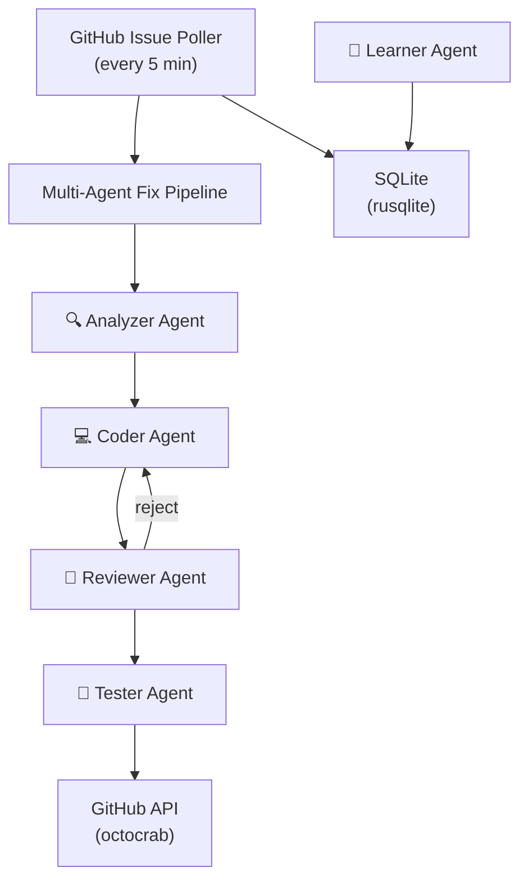

# SI-01: Software Implementation Report — Muninn

**Product:** 🐦 Muninn (Issue Watcher + Multi-Agent Auto-Fixer)
**Document ID:** SI-RPT-MUNINN-001
**Version:** 0.1.0
**Date:** 2026-03-16
**Standard:** ISO/IEC 29110 — SI Process
**Stack:** 🦀 Rust (Axum 0.8)

---

## 1. Product Overview

| Field | Value |
|:--|:--|
| **Repository** | MegaWiz-Dev-Team/Muninn |
| **Port** | `:8500` |
| **Container** | `asgard_muninn` |
| **Memory** | 30 MB idle / 64 MB limit |
| **Dependencies** | Huginn (scan findings), Heimdall (LLM), Gemini API, GitHub API |
| **BRD** | `Asgard/docs/business/odins-ravens-brd.md` v2.1 |
| **TRD** | `Asgard/docs/business/odins-ravens-trd.md` v1.1 |

---

## 2. Architecture

---

## 3. Functional Requirements Traceability

| FR | Description | Sprint | Status |
|:--|:--|:--|:--|
| FR-M01 | Repository Watcher (poll, filter, multi-repo) | S1 | 📋 Planned |
| FR-M02 | AI Issue Analyzer (root cause, complexity score) | S2 | 📋 Planned |
| FR-M03 | Auto-Fixer (branch, code gen, PR, human review) | S2 | 📋 Planned |
| FR-M04 | Multi-Agent Fix Pipeline (4 agents) | S3 | 📋 Planned |
| FR-M05 | Continuous Learning Agent | S4 | 📋 Planned |

---

## 4. Sprint Plan

| Sprint | Duration | Scope | Key Deliverables |
|:--|:--|:--|:--|
| **S1** | 2 weeks | Foundation | Scaffold, GitHub poller, label filter |
| **S2** | 2 weeks | AI Analyzer + Fix | Root cause analysis, auto-fix, PR creation |
| **S3** | 2 weeks | Multi-Agent Pipeline | Analyzer→Coder→Reviewer→Tester agents |
| **S4** | 2 weeks | Continuous Learning | Pattern detection, playbook, trend analysis |

---

## 5. Technology Stack

| Layer | Technology | Version |
|:--|:--|:--|
| Language | Rust | 2024 edition |
| Web Framework | Axum | 0.8 |
| Async Runtime | Tokio | 1.x |
| Database | rusqlite (SQLite) | 0.32 |
| HTTP Client | reqwest | 0.12 |
| GitHub API | octocrab | 0.41 |

---

## 6. Multi-Agent Fix Pipeline

| Agent | Role | LLM Model | Input | Output |
|:--|:--|:--|:--|:--|
| 🔍 Analyzer | Root cause + CWE | Gemini API | Issue + code | Analysis report |
| 💻 Coder | Generate fix | Qwen3.5 | Analysis | Code patch |
| 👀 Reviewer | Review fix | Gemini API | Code patch | Accept / Reject |
| 🧪 Tester | Write + run test | Qwen3.5 | Code patch | Test result |

**Safety Rules:**
- All PRs created as **draft** — never auto-merge
- PR title prefix: `[Muninn Auto-Fix]`
- Max 3 files per PR — if more, create issue instead
- Must pass `cargo check` / `npm test` before push
- Max 3 review cycles before escalating to human

---

## 7. Label Conventions

| Label | Meaning | Action |
|:--|:--|:--|
| `huginn-finding` | Created by Huginn scan | Auto-analyze |
| `security` | Security vulnerability | Analyze + fix |
| `vulnerability` | Known CVE | Check remediation DB |
| `auto-fix` | Explicit fix request | Generate fix + PR |
| `muninn-skip` | Skip analysis | Ignore |

---

## 8. Test Strategy

| Category | Method | Tool |
|:--|:--|:--|
| Unit tests | `#[cfg(test)]` per module | `cargo test` |
| Lint | Clippy | `cargo clippy` |
| Format | rustfmt | `cargo fmt` |
| Integration | GitHub API mock tests | `cargo test --test integration` |

---

## 9. Risk Assessment

| Risk | Impact | Mitigation |
|:--|:--|:--|
| Auto-fix introduces new bug | High | Draft PR only, reviewer agent, human approval |
| LLM generates incorrect fix | Medium | Multi-agent review + test agent |
| GitHub API rate limiting | Medium | Configurable poll interval, exponential backoff |
| Fix spans too many files | Medium | Max 3 files rule, escalate to issue |

---

*บันทึกโดย: AI Assistant (ISO/IEC 29110 SI Process)*
*Created: 2026-03-16 by Antigravity*
