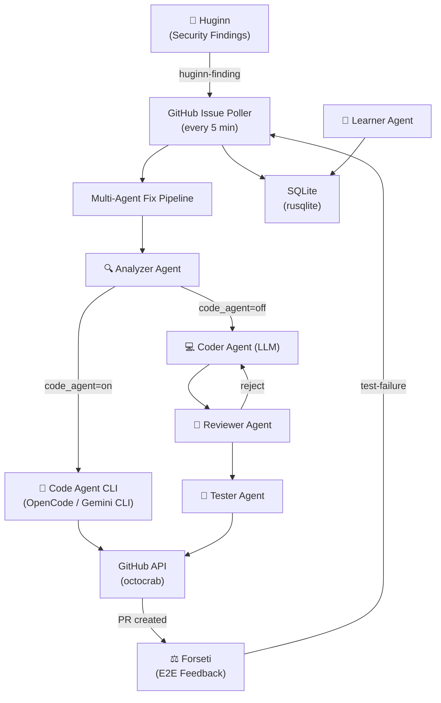
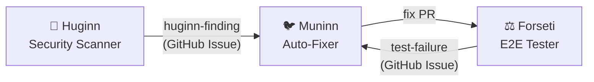

# SI-01: Software Implementation Report — Muninn

**Product:** 🐦 Muninn (Issue Watcher + Multi-Agent Auto-Fixer)
**Document ID:** SI-RPT-MUNINN-001
**Version:** 0.2.0
**Date:** 2026-03-18
**Standard:** ISO/IEC 29110 — SI Process
**Stack:** 🦀 Rust (Axum 0.8)

---

## 1. Product Overview

| Field | Value |
|:--|:--|
| **Repository** | MegaWiz-Dev-Team/Muninn |
| **Port** | `:8500` |
| **Container** | `asgard_muninn` |
| **Memory** | 30 MB idle / 64 MB limit |
| **Dependencies** | Huginn (scan findings), Forseti (E2E test findings), Heimdall (LLM), Gemini API, GitHub API, OpenCode CLI, Gemini CLI |
| **BRD** | `Asgard/docs/business/odins-ravens-brd.md` v2.1 |
| **TRD** | `Asgard/docs/business/odins-ravens-trd.md` v1.1 |

---

## 2. Architecture



---

## 3. Functional Requirements Traceability

| FR | Description | Sprint | Status |
|:--|:--|:--|:--|
| FR-M01 | Repository Watcher (poll, filter, multi-repo) | S1 | ✅ Done |
| FR-M02 | AI Issue Analyzer (root cause, complexity score) | S2 | ✅ Done |
| FR-M03 | Auto-Fixer (branch, code gen, PR, human review) | S2 | ✅ Done |
| FR-M04 | Code Agent CLI (OpenCode + Gemini CLI integration) | S2 | ✅ Done |
| FR-M05 | Manual Fix Trigger API (`POST /api/issues/{id}/fix`) | S2 | ✅ Done |
| FR-M06 | Multi-Agent Fix Pipeline (4 agents) | S3 | 📋 Planned |
| FR-M07 | Continuous Learning Agent | S4 | 📋 Planned |
| FR-M08 | Forseti Integration (E2E test feedback loop) | S3 | 📋 Planned |

---

## 4. Sprint History

| Sprint | Duration | Scope | Status | Key Deliverables |
|:--|:--|:--|:--|:--|
| **S1** | 2 weeks | Foundation | ✅ Done | Scaffold, GitHub poller, label filter, SQLite, health API |
| **S2** | 2 weeks | AI Fixer + Code Agent | ✅ Done | LLM analyzer, auto-fix PR, Code Agent CLI (OpenCode/Gemini), manual fix API |
| **S3** | 2 weeks | Multi-Agent Pipeline | 📋 Planned | Analyzer→Coder→Reviewer→Tester agents, Forseti integration |
| **S4** | 2 weeks | Continuous Learning | 📋 Planned | Pattern detection, playbook, trend analysis |

---

## 5. Technology Stack

| Layer | Technology | Version |
|:--|:--|:--|
| Language | Rust | 2021 edition |
| Web Framework | Axum | 0.8 |
| Async Runtime | Tokio | 1.x |
| Database | rusqlite (SQLite) | 0.32 |
| HTTP Client | reqwest | 0.12 |
| Code Agent (opt) | OpenCode CLI / Gemini CLI | latest |

---

## 6. Code Agent CLI Integration (S2 — New)

Muninn สามารถใช้ CLI code agent เพื่อแก้ไขโค้ดแบบ interactive ได้ นอกเหนือจาก LLM API:

| Provider | CLI Command | Mode | Env Variable |
|:--|:--|:--|:--|
| OpenCode | `opencode --prompt --non-interactive` | Subprocess | `CODE_AGENT_PROVIDER=opencode` |
| Gemini CLI | `gemini -p "<prompt>"` | Subprocess | `CODE_AGENT_PROVIDER=gemini_cli` |
| None (LLM API) | — | Direct API | `CODE_AGENT_PROVIDER=none` |

**Flow:**
```
Issue → LLM Analyze → Clone Repo → Code Agent Fix → git push → Create PR
                              ↓ (fallback if agent fails)
                         LLM Generate Fix → GitHub API Push → Create PR
```

**Safety Rules:**
- Code Agent runs in isolated `/tmp/muninn-workspace/`
- Timeout: 300s (configurable via `CODE_AGENT_TIMEOUT`)
- Max 3 files per fix
- All PRs created as **draft**

---

## 7. Multi-Agent Fix Pipeline

| Agent | Role | LLM Model | Input | Output |
|:--|:--|:--|:--|:--|
| 🔍 Analyzer | Root cause + CWE | Gemini API | Issue + code | Analysis report |
| 🤖 Code Agent | Interactive fix | OpenCode/Gemini CLI | Analysis | Modified files |
| 💻 Coder | Generate fix (fallback) | Qwen3.5 | Analysis | Code patch |
| 👀 Reviewer | Review fix | Gemini API | Code patch | Accept / Reject |
| 🧪 Tester | Write + run test | Qwen3.5 | Code patch | Test result |

**Safety Rules:**
- All PRs created as **draft** — never auto-merge
- PR title prefix: `[Muninn Auto-Fix]`
- Max 3 files per PR — if more, create issue instead
- Must pass `cargo check` / `npm test` before push
- Max 3 review cycles before escalating to human

---

## 8. Asgard Ecosystem Integration



| Integration | Direction | Mechanism |
|:--|:--|:--|
| Huginn → Muninn | Inbound | GitHub Issue with `huginn-finding` label |
| Forseti → Muninn | Inbound | GitHub Issue with `auto-fix` label on test failure |
| Muninn → Forseti | Outbound | Creates fix PR → Forseti runs E2E validation |

---

## 9. API Endpoints

| Method | Path | Description |
|:--|:--|:--|
| `GET` | `/health` | Health check |
| `GET` | `/healthz` | Health check (k8s) |
| `GET` | `/api/issues` | List tracked issues (filter: `?status=pending`) |
| `GET` | `/api/issues/{id}` | Get issue details |
| `POST` | `/api/issues/{id}/fix` | Trigger code agent fix manually |
| `GET` | `/api/stats` | Summary statistics |

---

## 10. Label Conventions

| Label | Meaning | Action |
|:--|:--|:--|
| `huginn-finding` | Created by Huginn scan | Auto-analyze |
| `security` | Security vulnerability | Analyze + fix |
| `vulnerability` | Known CVE | Check remediation DB |
| `auto-fix` | Explicit fix request | Generate fix + PR |
| `muninn-skip` | Skip analysis | Ignore |

---

## 11. Test Results

| Category | Tests | Status |
|:--|:--|:--|
| Unit tests | 60 | ✅ All pass |
| Code Agent tests | 20 | ✅ All pass |
| Lint (clippy) | — | ✅ Pass |

| Category | Method | Tool |
|:--|:--|:--|
| Unit tests | `#[cfg(test)]` per module | `cargo test` |
| Lint | Clippy | `cargo clippy` |
| Format | rustfmt | `cargo fmt` |
| Integration | GitHub API mock tests | `cargo test --test integration` |

---

## 12. Configuration

| Env Variable | Default | Description |
|:--|:--|:--|
| `PORT` | `8500` | Server port |
| `DATABASE_PATH` | `muninn.db` | SQLite path |
| `GITHUB_TOKEN` | — | GitHub API token |
| `WATCHED_REPOS` | — | Comma-separated repos |
| `POLL_INTERVAL_SECS` | `300` | Poll interval |
| `HEIMDALL_URL` | `http://host.docker.internal:8080` | Local LLM |
| `GEMINI_API_KEY` | — | Gemini API fallback |
| `CODE_AGENT_PROVIDER` | `none` | `opencode` / `gemini_cli` / `none` |
| `CODE_AGENT_WORK_DIR` | `/tmp/muninn-workspace` | Agent workspace |
| `CODE_AGENT_TIMEOUT` | `300` | Agent timeout (secs) |
| `OPENCODE_PATH` | `opencode` | OpenCode CLI binary |
| `GEMINI_CLI_PATH` | `gemini` | Gemini CLI binary |

---

## 13. Risk Assessment

| Risk | Impact | Mitigation |
|:--|:--|:--|
| Auto-fix introduces new bug | High | Draft PR only, reviewer agent, human approval |
| LLM generates incorrect fix | Medium | Multi-agent review + test agent |
| Code Agent timeout/hang | Medium | Configurable timeout (300s), process kill |
| GitHub API rate limiting | Medium | Configurable poll interval, exponential backoff |
| Fix spans too many files | Medium | Max 3 files rule, escalate to issue |

---

*บันทึกโดย: AI Assistant (ISO/IEC 29110 SI Process)*
*Created: 2026-03-16 | Updated: 2026-03-18 by Antigravity*
*Sprint 2 completed: Code Agent CLI integration (OpenCode + Gemini CLI)*
